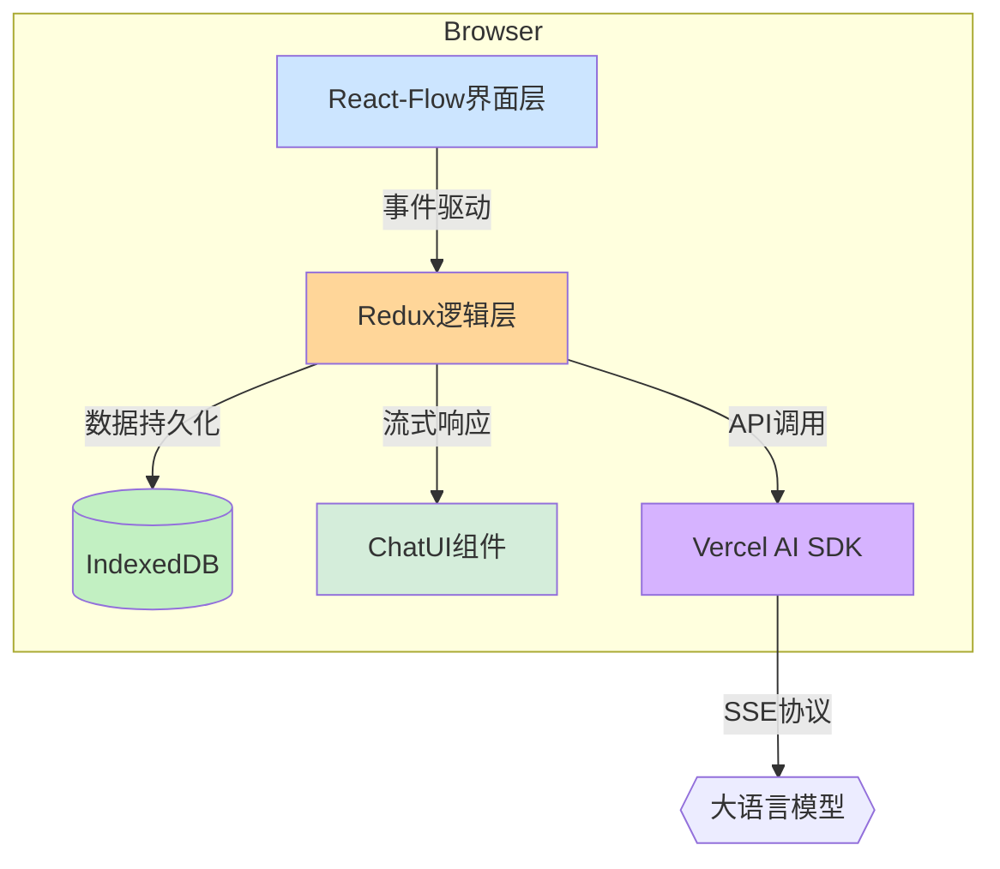

# 架构设计文档 v2.0
## 版本历史
- v1.0 (2025/4/19) 初始版本
- v2.0 (2025/4/19) 整合技术细节，完善架构说明

## 阶段范围
对应架构设计阶段产出物

## 架构决策背景
1. 分离产品设计与技术实现，确保架构可演进性
2. 采用分层架构模式，明确各层职责边界
3. 平衡扩展性与性能指标要求

## 系统架构图


## 技术架构细节
### 核心模块划分
1. 可视化引擎层
   - 基于React-Flow的节点渲染引擎
   - 支持动态布局算法
   - 节点样式继承jsMind规范

2. 对话交互层
   - ChatUI消息协议实现
   - SSE流式响应处理
   - @符号节点定位解析器

3. 数据持久层
   - IndexedDB存储引擎
   - LZMA压缩算法集成
   - 自动备份恢复机制

4. AI集成层
   - Vercel AI SDK适配器
   - 多LLM供应商接口
   - 响应结果结构化处理

### 关键接口规范
```typescript
// 模块间通信协议
interface ModuleAPI {
  initMindmap(config: MindmapConfig): Promise<void>;
  handleUserInput(input: UserInput): Promise<AIResponse>;
  exportMindmap(format: ExportFormat): Promise<Blob>;
}
