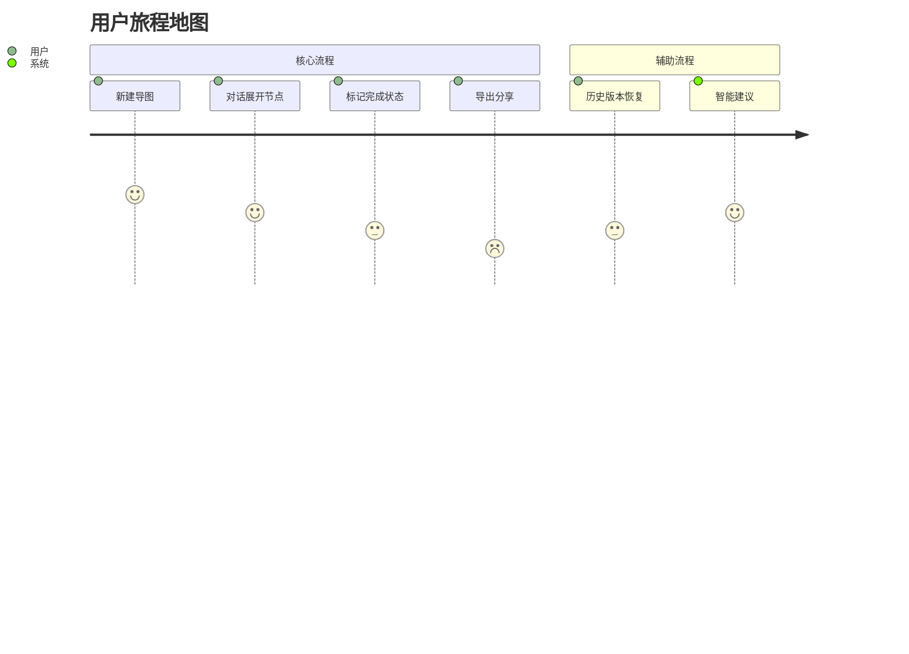

# 产品设计文档 v2.0
## 版本历史
- v1.0 (2025/4/19) 初始版本
- v2.0 (2025/4/19) 剥离技术细节，聚焦产品设计

## 阶段范围
对应产品设计阶段产出物

## 用户故事地图


## 功能优先级矩阵
| 功能模块         | Must | Should | Could | Won't |
|------------------|------|--------|-------|-------|
| 基础节点操作     | ✅    |        |       |       |
| AI对话交互       | ✅    |        |       |       |
| 离线存储         |      | ✅      |       |       |
| 多主题颜色标记   |      |        | ✅     |       |
| 协作批注         |      |        |       | ✅     |

## 交互原型设计
```mermaid
flowchart TD
    A[主界面] --> B{操作类型}
    B -->|点击节点| C[展开上下文菜单]
    B -->|输入@符号| D[触发节点定位]
    C --> E[显示操作选项]
    D --> F[弹出节点搜索框]
    E --> G[删除/重命名/标记]
    F --> H[定位并聚焦节点]
```

## 体验度量指标
1. 首次节点展开时间 ≤1.5秒
2. 对话响应延迟 ≤3秒
3. 核心路径操作步骤 ≤3步
4. 错误恢复成功率 ≥95%
