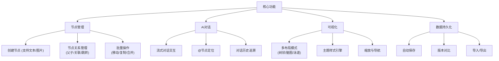
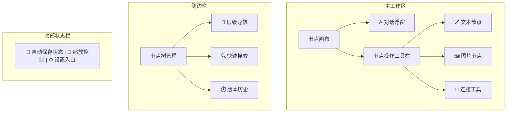
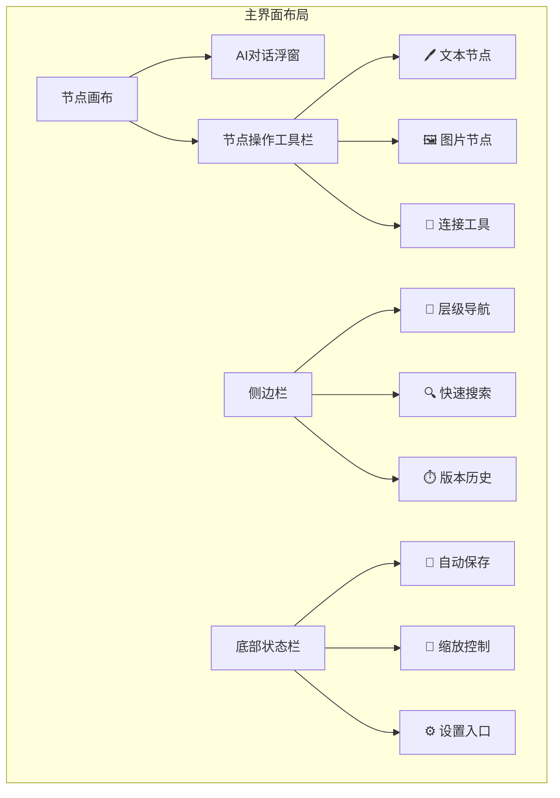

# 产品需求文档 v1.1
## 版本历史
- v1.0 (2025/4/21) 初始版本
- v1.1 (2025/4/21) 同步最新需求规范

## 产品概览


## 详细功能矩阵
### 节点管理模块
| 功能点           | 子功能                 | 输入                  | 输出                  | 优先级 | 依赖项          |
|------------------|-----------------------|----------------------|----------------------|--------|----------------|
| 节点CRUD        | 创建文本节点          | 用户输入文本          | 新节点对象            | P0     | ReactFlow      |
|                  | 删除节点              | 节点ID               | 更新节点树            | P0     | Zustand        |
|                  | 编辑节点内容          | 节点ID+新内容         | 更新节点内容          | P0     | ContentEditable|
| 节点关系        | 创建父子关系          | 拖拽连接线            | 更新节点关系树        | P1     | ReactFlow连线  |
|                  | 关联节点标记          | 选择多个节点          | 虚线关联线            | P2     | 自定义连线类型  |

### AI对话模块
| 功能点           | 子功能                 | 触发条件              | 业务规则                          | 异常处理                  |
|------------------|-----------------------|----------------------|----------------------------------|--------------------------|
| 流式响应        | SSE数据分块处理       | 接收API响应           | 每200ms更新一次内容               | 断线重试3次机制           |
| 上下文管理      | 对话历史缓存          | 新对话发起            | 保留最近5轮对话                   | 超出长度LRU淘汰           |
| 节点关联        | @符号解析             | 检测@字符输入         | 展示节点选择浮窗                   | 无效引用提示              |
| 结果结构化      | 自动创建子节点        | AI响应包含节点标记    | 根据标记深度创建对应层级节点        | 格式错误时降级为文本       |
| 用户确认机制    | 覆盖/新增子节点       | AI响应完成            | 提供三种操作选项                   | 超时自动保存为草稿         |
|                  | - 覆盖现有节点        | 用户选择覆盖          | 替换目标节点内容                   | 保留历史版本              |
|                  | - 新增为子节点        | 用户选择新增          | 创建新节点并建立父子关系            | 自动布局                  |
|                  | - 拒绝采纳            | 用户选择拒绝          | 仅保留对话历史                     | 可重新激活                |

## 交互流程规范
```mermaid
journey
    title 核心功能交互流程
    section 创建节点
      用户输入: 5: 用户
      自动布局: 3: 系统
      持久化存储: 4: 系统
    
    section AI对话
      触发指令: 5: 用户
      流式响应: 5: 系统
      用户确认: 5: 用户
      节点操作: 4: 系统
         分支 覆盖节点
         分支 新增子节点
         分支 拒绝采纳
    
    section 版本恢复
      选择历史版本: 3: 用户
      差异对比: 4: 系统
      确认恢复: 3: 用户
```

## 交互原型设计


## 界面原型规范



ASCII线框图示例：
```
+-----------------------------------------------+
|  🧠 AI-Mind-Map v1.0                          |
+----------------------+------------------------+
|  侧边栏              |                        |
|  +---------------+  |  主工作区              |
|  |  📂 层级导航   |  |  +-----------------+ |
|  |  🔍 搜索框    |  |  |                 | |
|  |  ⏱️ 版本历史  |  |  |  节点树可视化    | |
|  +---------------+  |  |                 | |
|                      |  +-----------------+ |
|                      |                        |
|  +-----------------+ |  +-----------------+ |
|  | 🖊️🖼️🔗 工具栏 | |  | 💬 AI对话浮窗    | |
|  +-----------------+ |  | 输入框@节点     | |
|                      |  | 流式响应区域     | |
|                      |  +-----------------+ |
+----------------------+------------------------+
| 🔄 自动保存中 | 缩放: 100% | ⚙️ 设置           |
+-----------------------------------------------+
```

关键交互元素说明：
1. 节点画布区：
   - 支持拖拽创建/连接节点
   - 右键菜单含「展开对话」「删除节点」等操作
   - 快捷键支持(Ctrl+Z/Y撤销重做)

2. AI对话浮窗：
   - 输入框支持Markdown语法
   - @符号触发节点关联
   - 响应区带语法高亮

3. 侧边栏管理：
   - 树形结构展示节点层级
   - 版本对比采用双栏diff视图
   - 搜索支持正则表达式
```


关键界面状态：
1. **节点选中状态**：蓝色边框+阴影效果
2. **AI响应中**：流式文字+加载动画
3. **错误提示**：顶部红色横幅通知
4. **版本对比**：分屏显示差异高亮
```

## 数据埋点规范
| 事件类型       | 埋点参数                                      | 触发时机                     |
|---------------|---------------------------------------------|----------------------------|
| 节点创建      | {type: text/img, depth: N, parentId: string} | 节点DOM渲染完成              |
| AI对话        | {inputLength: N, responseTime: ms, success: bool} | API响应返回时               |
| 错误发生      | {errorCode: string, context: string}         | 异常捕获时                  |
| 导出操作      | {format: png/md/json, nodeCount: N}          | 导出文件生成成功             |

## 术语定义
| 术语         | 定义                                   |
|-------------|---------------------------------------|
| 节点深度     | 节点在树状结构中的层级，根节点为0       |
| 流式响应     | 通过SSE实现的逐字输出效果               |
| 视图聚焦     | 自动滚动到目标节点并高亮显示             |
| LRU淘汰     | 最近最少使用缓存淘汰策略                 |
