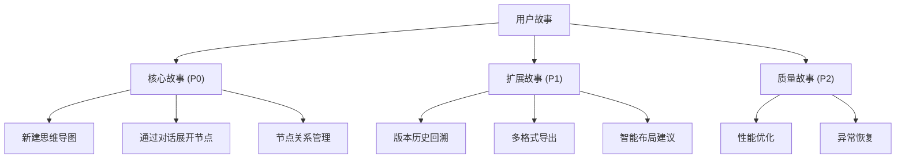

# 需求确认文档 v1.3
## 版本历史
- v1.0 (2025/4/19) 初始版本
- v1.1 (2025/4/19) 根据阶段要求重构文档结构
- v1.2 (2025/4/21) 补充完整用户故事体系
- v1.3 (2025/4/21) 增加AI交互确认机制

## 用户故事体系


### 核心故事 (P0)
1. **US1: 新建思维导图**
- 创建空白导图
- 添加/删除根节点
- 自动保存机制

2. **US2: 通过对话展开节点**
- @符号节点定位上下文
- 流式AI响应展示
- 用户确认机制：
  ```mermaid
  graph TD
      A[AI生成结果] --> B{用户操作}
      B -->|接受| C[创建子节点]
      B -->|修改| D[编辑后创建]
      B -->|拒绝| E[丢弃结果]
      C --> F[覆盖现有节点]
      C --> G[新增为子节点]
  ```
- 支持快捷键操作（Ctrl+Enter确认）

3. **US3: 节点关系管理** 
- 父子关系建立/解除
- 关联关系标记
- 批量节点操作

### 扩展故事 (P1)
4. **US4: 版本历史回溯**
- 时间轴浏览
- 差异对比视图
- 版本恢复功能

5. **US5: 多格式导出**
- PNG图片导出
- Markdown文本导出
- JSON结构化导出

6. **US6: 智能布局建议**
- 拥挤区域检测
- 布局优化建议
- 一键应用布局

### 质量故事 (P2)
7. **US7: 性能优化**
- 首屏加载 <3s
- 节点操作延迟 <300ms
- 内存占用 <500MB

8. **US8: 异常恢复**
- 断网自动保存
- 冲突解决机制
- 错误步骤回滚

## 非功能性需求
1. 核心框架要求：
   - React-Flow v11.7.0
   - ChatUI v0.3.5  
   - Vercel AI SDK v2.2.0
2. 性能要求：
   - 首屏加载时间 < 3s
   - Tree Shaking减少40%包体积
3. 存储方案：
   - IndexedDB + LZMA压缩
   - 5分钟自动备份机制
4. 交互规范：
   - 支持@符号节点上下文关联
   - SSE流式响应+用户确认机制：
     * 支持覆盖/新增子节点操作
     * 快捷键确认(Ctrl+Enter)
     * 修改后保存功能
   - 响应结果结构化处理
5. 构建要求：
   - Webpack生产模式优化
   - 浏览器兼容性：Chrome 90+/Safari 15+
