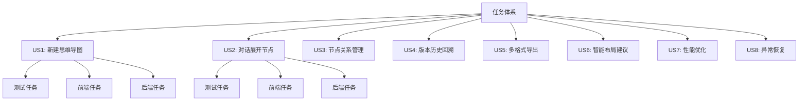
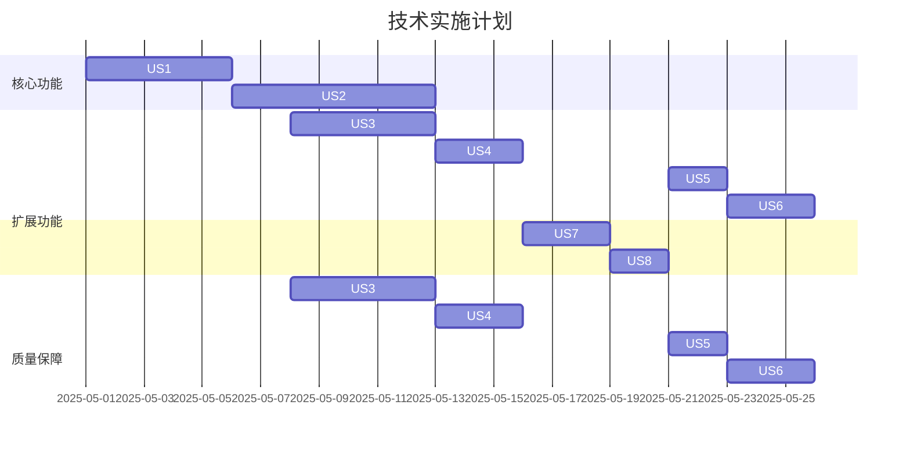

# AI-Mind-Map 开发任务文档 v1.1



## US1: 新建思维导图
### 测试任务
```markdown
- [ ] **US1-T-001** [INT]导图初始化测试（Testing Library）
  - 验证React-Flow v11.7.0配置
  - 检查自动保存触发机制
  - 覆盖率要求：≥90%
- [ ] **US1-T-002** [UNIT]节点CRUD测试（Jest）
  - 根节点创建/删除功能
  - 批量操作性能测试
  - 验证IndexedDB存储结构
```

### 前端任务
```markdown
- [ ] **US1-FE-001** 画布核心组件（React-Flow）
  - 基础画布配置
  - 节点拖拽/选择交互
  - 集成Zustand状态管理
- [ ] **US1-FE-002** 自动保存机制
  - 5分钟定时保存
  - 防抖处理(300ms)
  - 状态提示组件
```

### 后端任务
```markdown
- [ ] **US1-BE-001** 节点存储服务
  - IndexedDB结构设计
  - LZMA压缩集成
  - 事务回滚支持
- [ ] **US1-BE-002** 批量操作API
  - 批量节点CRUD接口
  - 并发控制机制
```

## US2: 对话展开节点
### 测试任务
```markdown
- [ ] **US2-T-001** [E2E]流式交互测试（Cypress）
  - 验证SSE每200ms更新
  - 测试@节点定位准确性
  - 覆盖率要求：≥95%
- [ ] **US2-T-002** [INT]用户确认测试（Testing Library）
  - 覆盖/新增/拒绝三种操作
  - 快捷键(Ctrl+Enter)功能
  - 响应结构化验证
```

### 前端任务
```markdown
- [ ] **US2-FE-001** AI对话组件（Vercel AI SDK）
  - 流式响应展示
  - @符号节点关联
  - 用户确认操作面板
- [ ] **US2-FE-002** 响应处理器
  - 结构化结果解析
  - 自动节点创建逻辑
  - 错误降级处理
```

### 后端任务
```markdown
- [ ] **US2-BE-001** 对话上下文服务
  - LRU缓存(保留5轮)
  - 请求限流(10次/分钟)
  - 异常重试机制(3次)
- [ ] **US2-BE-002** 节点操作API
  - 覆盖节点接口
  - 新增子节点接口
  - 操作历史记录
```

## 技术依赖关系


## US3: 节点关系管理
### 测试任务
```markdown
- [ ] **US3-T-001** [INT]节点连接测试（Testing Library）
  - 父子关系建立/解除验证
  - 关联标记可视化检查
  - 覆盖率要求：≥85%
- [ ] **US3-T-002** [INT]批量操作测试（Jest）
  - 多节点选择性能测试
  - 批量移动/复制验证
  - 内存泄漏检测
```

### 前端任务
```markdown
- [ ] **US3-FE-001** 节点关系组件
  - 拖拽连接线实现
  - 关联标记虚线样式
  - 右键菜单增强
- [ ] **US3-FE-002** 批量操作面板
  - 多选模式实现
  - 群组操作UI
  - 快捷键支持
```

### 后端任务
```markdown
- [ ] **US3-BE-001** 节点关系服务
  - 关系存储结构设计
  - 事务性批量操作
  - 并发冲突处理
```

## US4: 版本历史回溯
### 测试任务
```markdown
- [ ] **US4-T-001** [E2E]版本对比测试（Cypress）
  - 时间轴导航验证
  - 差异高亮准确性
  - 恢复操作成功率≥99%
- [ ] **US4-T-002** 自动备份测试（Jest）
  - 5分钟备份机制
  - LZMA压缩验证
  - 备份完整性检查
```

### 前端任务
```markdown
- [ ] **US4-FE-001** 版本历史组件
  - 时间轴可视化
  - 双栏diff视图
  - 恢复确认对话框
- [ ] **US4-FE-002** 自动备份模块
  - 定时任务管理
  - 状态提示组件
  - 手动触发备份
```

### 后端任务
```markdown
- [ ] **US4-BE-001** 版本控制服务
  - 快照存储策略
  - 差异计算算法
  - 版本元数据管理
```

## US5: 多格式导出
### 测试任务
```markdown
- [ ] **US5-T-001** [E2E]导出功能测试（Cypress）
  - PNG渲染验证
  - Markdown结构检查
  - JSON schema校验
- [ ] **US5-T-002** [INT]文件生成测试（Jest）
  - 大文件导出性能
  - 特殊字符处理
  - 错误重试机制
```

### 前端任务
```markdown
- [ ] **US5-FE-001** 导出面板组件
  - 格式选择器
  - 导出进度显示
  - 错误反馈机制
- [ ] **US5-FE-002** 可视化渲染器
  - SVG转PNG处理
  - 画布缩放控制
  - 背景网格选项
```

### 后端任务
```markdown
- [ ] **US5-BE-001** 导出服务
  - 并行导出处理
  - 文件压缩优化
  - 临时文件清理
```

## US6: 智能布局建议
### 测试任务
```markdown
- [ ] **US6-T-001** 布局算法测试（Jest）
  - 拥挤区域检测准确率
  - 布局计算性能
  - 内存占用监控
- [ ] **US6-T-002** UI交互测试（Testing Library）
  - 建议面板响应速度
  - 一键应用效果
  - 撤销操作支持
```

### 前端任务
```markdown
- [ ] **US6-FE-001** 智能布局引擎
  - 力导向布局集成
  - 实时密度分析
  - 动画过渡效果
- [ ] **US6-FE-002** 建议交互模块
  - 浮动提示面板
  - 差异预览功能
  - 用户偏好记忆
```

### 后端任务
```markdown
- [ ] **US6-BE-001** 布局计算服务
  - Web Worker并行计算
  - 布局缓存机制
  - 复杂度预警系统
```

## US7: 性能优化
### 测试任务
```markdown
- [ ] **US7-T-001** 首屏加载测试（Lighthouse）
  - 冷启动加载时间 <3s
  - 资源压缩验证
  - Tree Shaking有效性检查
- [ ] **US7-T-002** 操作延迟测试（Chrome DevTools）
  - 节点CRUD操作 <300ms
  - 布局计算 <500ms
  - 内存占用峰值 <500MB
```

### 前端任务
```markdown
- [ ] **US7-FE-001** 性能优化专项
  - 代码分割+动态加载
  - 虚拟滚动列表
  - 画布渲染节流
- [ ] **US7-FE-002** 内存管理
  - 节点缓存策略
  - 未激活模块懒加载
  - 内存泄漏检测
```

### 后端任务
```markdown
- [ ] **US7-BE-001** 接口性能优化
  - 批量操作接口并行化
  - 查询结果缓存
  - 压缩传输优化
```

## US8: 异常恢复
### 测试任务
```markdown
- [ ] **US8-T-001** [E2E]网络异常测试（Cypress）
  - 断网自动保存机制
  - 冲突解决流程验证
  - 恢复成功率 ≥99.9%
- [ ] **US8-T-002** [INT]错误回滚测试（Jest）
  - 操作历史追溯
  - 异常状态恢复
  - 数据完整性检查
```

### 前端任务
```markdown
- [ ] **US8-FE-001** 异常处理模块
  - 自动保存草稿功能
  - 错误边界处理
  - 恢复引导界面
- [ ] **US8-FE-002** 状态同步机制
  - 操作历史快照
  - 差异对比算法
  - 冲突解决UI
```

### 后端任务
```markdown
- [ ] **US8-BE-001** 容错服务
  - 事务回滚机制
  - 操作日志持久化
  - 自动备份恢复
```

## 跨US集成测试场景
```markdown
- [ ] **E2E-INT-001** AI对话后导出测试（Cypress）
  - 通过对话创建新节点
  - 执行Markdown导出
  - 验证导出内容结构
- [ ] **E2E-INT-002** 版本恢复后布局测试（Cypress）
  - 回滚到历史版本
  - 触发智能布局建议
  - 验证布局合理性
```

## 质量保障
   - 核心模块 ≥90%
   - 辅助模块 ≥70%
2. 性能基准：
   - 画布操作延迟 < 300ms
   - AI响应首字 < 1s
3. 安全要求：
   - 所有API必须通过OWASP测试
   - 敏感数据加密存储

## 版本策略
- 开发分支：`feat/[story-id]`
- 测试分支：`test/[sprint-id]`
- 发布标签：`v[major].[minor]`
