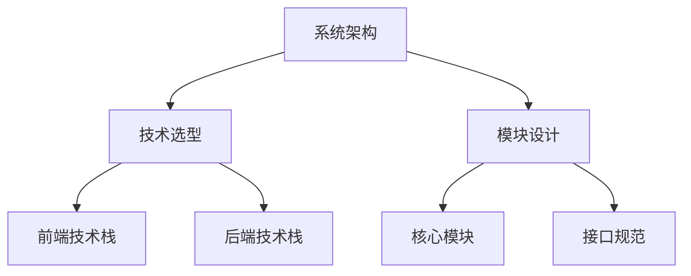
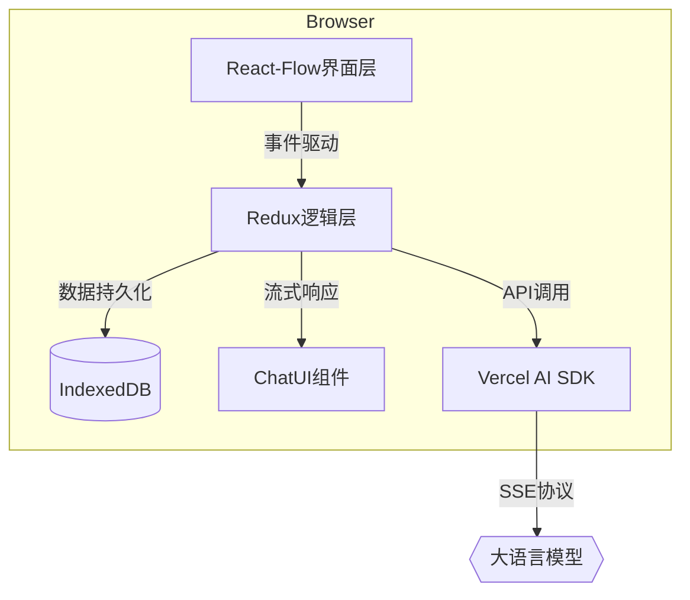
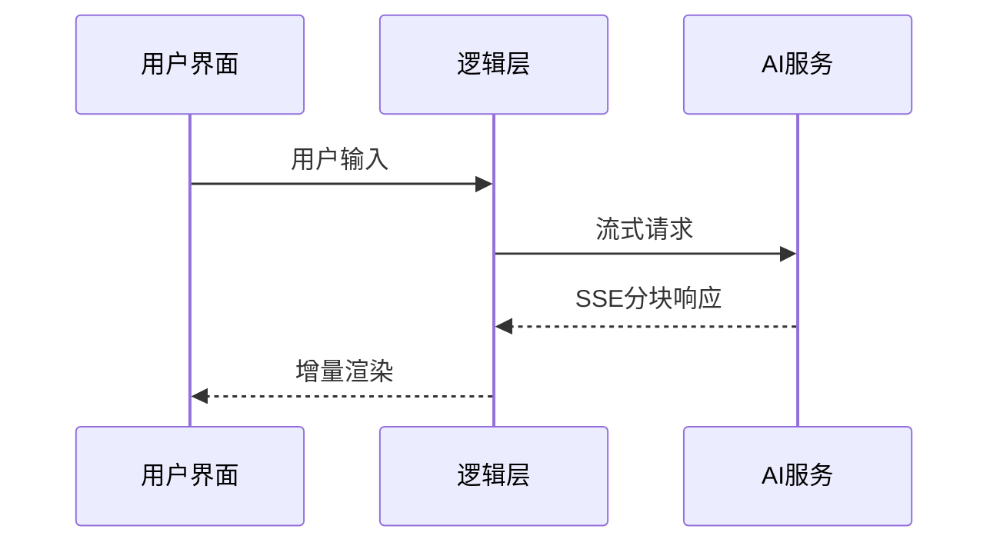

# 架构与技术栈文档 v1.0



## 1. 系统架构设计
### 1.1 整体架构


### 1.2 分层架构
| 层级 | 技术实现 | 职责 |
|------|----------|------|
| 界面层 | React-Flow v11.7.0 | 节点可视化与交互 |
| 逻辑层 | Zustand + Redux | 状态管理与业务逻辑 |
| 持久层 | IndexedDB + LZMA | 数据存储与压缩 |
| AI集成层 | Vercel AI SDK v2.2.0 | LLM通信与适配 |

## 2. 技术选型
### 2.1 前端技术栈
| 分类 | 技术选型 | 版本 | 关键特性 |
|------|----------|------|----------|
| 可视化 | React-Flow | 11.7.0 | 企业级节点操作API |
| 状态管理 | Zustand | 4.4.0 | 轻量级状态解决方案 |
| 对话框架 | ChatUI | 0.3.5 | 阿里开源消息协议 |
| 构建工具 | Webpack | 5.75.0 | Tree Shaking支持 |

### 2.2 后端技术栈
| 分类 | 技术选型 | 版本 | 关键特性 |
|------|----------|------|----------|
| 节点服务 | NodeCRUDService | 2.0.0 | 领域驱动设计 |
| 存储引擎 | IndexedDB | - | 浏览器原生存储 |
| 压缩算法 | LZMA | 2.3.0 | 高压缩比 |
| API框架 | Express | 4.18.2 | 轻量级路由 |

## 3. 核心模块设计
### 3.1 节点管理层
```typescript
interface NodeService {
  createNode(payload: NodeDTO): Promise<Node>;
  deleteNode(id: string): Promise<void>;
  updateNode(id: string, changes: Partial<Node>): Promise<Node>;
}
```

### 3.2 对话交互层


## 4. 质量保障
### 4.1 测试矩阵
| 测试类型 | 工具 | 覆盖率要求 |
|----------|------|------------|
| 单元测试 | Jest | ≥90% |
| E2E测试 | Cypress | 核心路径100% |

### 4.2 监控指标
- 节点操作延迟 < 300ms
- AI响应首字时间 < 1s
- 内存占用 < 500MB

## 5. 版本策略
- LTS版本：
  - React-Flow v11.x (支持至2026年)
  - Vercel AI SDK v2.x
- 发布周期：
  - 每周迭代版本
  - 每月稳定版本
