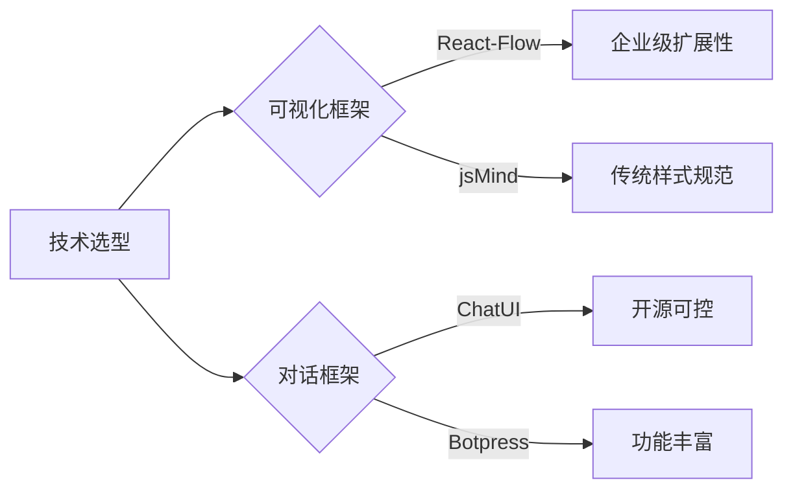

# 技术选型文档 v1.0
## 版本历史
- v1.0 (2025/4/19) 初始版本

## 阶段范围
对应技术选型阶段产出物

## 前端技术栈
| 分类         | 技术选型             | 版本   | 优点                      | 注意事项                |
|--------------|---------------------|--------|--------------------------|-----------------------|
| 可视化框架   | React-Flow          | 11.7.0 | 企业级节点操作API         | 需自定义样式适配        |
| 对话框架     | ChatUI              | 0.3.5  | 阿里开源，消息协议完善    | 移动端适配需优化        |
| 状态管理     | Zustand             | 4.4.0  | 轻量级状态解决方案        | 需配合immer使用        |
| AI集成       | Vercel AI SDK       | 2.2.0  | 流式响应支持完善          | 需自定义适配器          |
| 数据持久化   | IndexedDB           | N/A    | 浏览器原生存储方案        | 需LZMA压缩支持         |

## 候选方案对比


## 版本策略
1. 长期支持版本：
   - React-Flow v11.x (LTS到2026年)
   - Vercel AI SDK v2.x
2. 开发依赖锁定：
   ```json
   "resolutions": {
     "react-flow-renderer": "11.7.0",
     "@chatui/core": "0.3.5"
   }
   ```

## 风险控制
1. 备用方案：
   - 可视化：备用D3.js方案
   - 对话框架：备用Custom Hooks方案
2. 兼容性测试矩阵：
   | 浏览器       | 最低版本 | 测试状态 |
   |-------------|---------|---------|
   | Chrome      | 90      | ✅       |
   | Safari      | 15      | ✅       |
   | Firefox     | 78      | ⚠️需polyfill |
